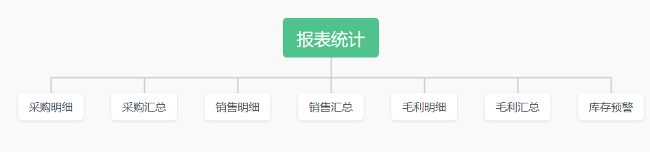

# 宏睿工作室——ERP系统设计

## 1. 简介

​		本项目是自己写的一个ERP系统，主要是为了练手，当前项目主要以.Net 6 MVC + SqlSugar + LayUI框架进行实现，后面更新维护之后会做到支持前后端分离。

## 2. 开发平台

本系统采用的开发软件是 VS 2022 + Sql Server 2014

## 3. 主要实现模块

### 3.1 主模块功能图

### 3.2 子模块功能图

#### 3.2.1 基础管理

#### 3.2.2 采购管理

#### 3.2.3 销售管理

#### 3.2.4 仓库管理

#### 3.2.5 生产管理

#### 3.2.6 客户管理

#### 3.2.7 财务管理

#### 3.2.8 报表统计

#### 3.2.9 系统管理

### 3.3 数据库设计

数据库名：erp_sysDb

该数据库表名命名时，在表名的前面会加有前缀，前缀的含义如下：

| 前缀 | 说明                   |
| ---- | ---------------------- |
| BS   | 基础管理模块对应信息表 |
| PU   | 采购管理模块对应信息表 |
| SE   | 销售管理模块对应信息表 |
| ST   | 仓库管理模块对应信息表 |
| PR   | 生产管理模块对应信息表 |
| CU   | 客户管理模块对应信息表 |
| FI   | 财务管理模块对应信息表 |
| SY   | 系统管理模块对应信息表 |
| IN   | 内置的系统信息数据表   |

数据表如下：

#### 3.3.1 管理账号表（BSAccount）

| 列名        | 中文名   | 数据类型      | 说明 |
| ----------- | -------- | ------------- | ---- |
| AccountCode | 账户编码 | varchar(19)   | 主键 |
| AccountName | 账户名称 | varchar(50)   | 非空 |
| BankAccount | 银行账户 | varchar(19)   |      |
| AccSubject  | 会计科目 | varchar(19)   |      |
| AccMoney    | 账户金额 | decimal(12,2) |      |

#### 3.3.2 物料清单(BSBom)

| 列名         | 中文名   | 数据类型    | 说明 |
| ------------ | -------- | ----------- | ---- |
| ProInvenCode | 父件编码 | varchar(10) | 主键 |
| MatInvenCode | 子件编号 | varchar(10) | 主键 |
| Quantity     | 组成数量 | int         |      |
